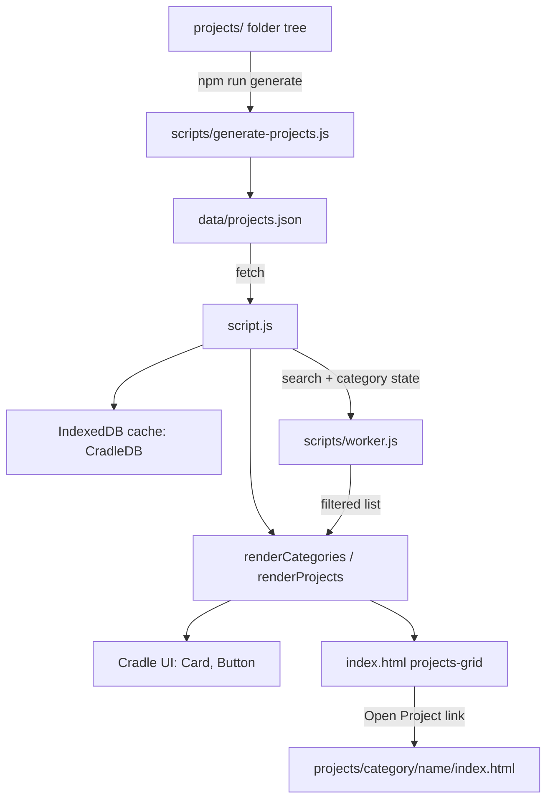

# Architecture.md - Cradle

## Overview

Cradle is a personal, static, framework-free website that catalogs a growing collection of small experiments: games, AI/ML demos, dev tools, productivity utilities, and misc projects. The repository is not one application but two layers: a root landing page that lists and links to every project, and a `projects/` directory of independent, self-contained mini-projects. A small Node.js script scans the project folders and generates the metadata the landing page reads, so the list of projects never has to be hand-maintained.

---

## Purpose & Goals

- Give visitors and contributors a single entry point to browse every experiment in the repo
- Keep each project fully isolated and independently runnable, with no shared framework or build step
- Derive project metadata from the folder structure instead of a hand-written registry
- Offer a small, dependency-free UI component library that the landing page and, optionally, individual projects can reuse
- Stay runnable as static files, with no bundler or server required

---

## Folder Structure

```
cradle/
├── index.html                    # Landing page shell: hero, search, category filters, project grid
├── script.js                     # Landing page logic: fetch/cache projects, render grid, filtering
├── style.css                     # Landing page styles
├── package.json                  # npm scripts (generate, dev, build) and repo metadata
├── package-lock.json
│
├── data/
│   └── projects.json             # Generated project registry, consumed by script.js
│
├── scripts/
│   ├── generate-projects.js      # Scans projects/ and (re)writes data/projects.json
│   ├── theme.js                  # Light/dark theme init + toggle, persisted to localStorage
│   └── worker.js                 # Web Worker offloading search/category filtering from the main thread
│
├── src/
│   └── components/
│       └── ui/                   # Cradle UI - shared, framework-free component library
│           ├── tokens.css        # Design tokens (colors, spacing) shared by all components
│           ├── index.js          # Barrel loader exposing window.CradleUI, lazy-loads components
│           ├── demo.html         # Standalone demo/preview page for the component library
│           ├── README.md         # Component library usage docs
│           ├── Button/Button.js
│           ├── Card/Card.js
│           ├── ThemeToggle/ThemeToggle.js
│           ├── Navbar/Navbar.js
│           └── BackToHome/BackToHome.js
│
├── projects/                     # Every experiment, grouped by category
│   ├── aiml/                     # ai-circuit-builder, image-classifier, neural-network-playground
│   ├── dev-tools/                # cpu-emulator
│   ├── games/                    # 2048-game, cannon-shooting, chess, dot-game, ludo-game,
│   │                              #   memory-flip-game, stone-paper-scissors-game
│   ├── misc/                     # meme-generator
│   └── productivity/             # attendance-tracker
│       └── <project-name>/       # Each project folder is self-contained:
│           ├── index.html        #   own entry point
│           ├── script.js/logic.js
│           ├── style.css
│           ├── README.md         #   project-specific readme
│           └── ARCHITECTURE.md   #   project-specific architecture doc
│
├── tests/                        # Root-level tests over individual projects' pure logic modules
│   ├── 2048-grid.test.js
│   ├── 2048-logic.test.js
│   ├── attendance-tracker.test.js
│   ├── chess-logic.test.js
│   ├── memory-flip.test.js
│   └── stone-paper-scissors.test.js
│
├── ARCHITECTURE.md               # This file
├── ARCHITECTURE_TEMPLATE.md      # Template every project copies for its own ARCHITECTURE.md
├── CONTRIBUTING.md
├── CODE_OF_CONDUCT.md
└── README.md
```

---

## System / Project Architecture Overview

Cradle is a directory of independent applications sitting behind a shared discovery layer.

- The **discovery layer** (`index.html`, `script.js`, `style.css`) has no knowledge of any project's internal code. It only reads the metadata in `data/projects.json`: a title, a category, and a relative path.
- Each **project** under `projects/<category>/<name>/` is a standalone static site with its own `index.html`. It does not import from the root app, and the root app does not import from it. The only requirement is that the folder sits under `projects/` so `generate-projects.js` can discover it.
- The **component library** (`src/components/ui/`) is an optional shared dependency, loaded via `<script>` tags. The root app uses it directly; individual projects may opt in but are not required to.
- There is no backend and no build step to run the site: it is served as static files.



---

## Component Breakdown

| File / Path | Responsibility |
|---|---|
| `index.html` | Landing page markup: hero, search box, category buttons, project grid, footer |
| `script.js` | Landing page controller: loads/caches project data, renders categories and cards, wires search and filter events |
| `style.css` | Landing page visual styling |
| `data/projects.json` | Generated flat list of `{ title, category, path }` for every project |
| `scripts/generate-projects.js` | Build-time script that walks `projects/` and regenerates `data/projects.json` |
| `scripts/theme.js` | Light/dark theme state, `localStorage` persistence, toggle button wiring |
| `scripts/worker.js` | Web Worker that filters the project list by category and search query off the main thread |
| `src/components/ui/*` | Shared UI primitives (Button, Card, ThemeToggle, Navbar, BackToHome) and design tokens |
| `projects/<category>/<name>/` | One self-contained experiment with its own HTML/CSS/JS, README, and ARCHITECTURE.md |
| `tests/*.test.js` | Node's built-in test runner exercising pure logic exported by individual projects |

---

## Data Flow / Execution Flow

```
Contributor adds projects/<category>/<project-name>/ with an index.html
        ↓
`npm run generate` runs scripts/generate-projects.js
        ↓
Reads every subdirectory of projects/<category>/, title-cases the folder
name (with acronym fixes, e.g. "ai" → "AI", "cpu" → "CPU")
        ↓
Sorts entries alphabetically by title and writes them to
data/projects.json (generated file, not hand-edited)
        ↓
Browser opens index.html → loads script.js (ES module)
        ↓
script.js opens an IndexedDB database ("CradleDB")
        ↓
   Cache hit  → render immediately from cached data, then re-fetch
                data/projects.json in the background and re-render
   Cache miss → fetch data/projects.json directly, populate the cache
        ↓
renderCategories() builds category buttons; renderProjects() builds one
CradleCard per project, each linking to its path via an "Open Project"
CradleButton
        ↓
User types in the search box or clicks a category button
        ↓
If Web Workers are supported, the project list + filters are posted to
scripts/worker.js, which filters off the main thread and posts back the
result; otherwise script.js filters synchronously
        ↓
renderProjects() re-renders the grid with the filtered list
```

---

## Key Features

- Zero-build static site: no bundler, framework, or transpilation needed to run or contribute
- Project registry auto-generated from the folder tree (`scripts/generate-projects.js`)
- Client-side search and category filtering, offloaded to a Web Worker when available
- IndexedDB caching of the project list for instant repeat loads, with background refresh
- Light/dark theme with `localStorage` persistence and an inline pre-paint script to avoid a flash of the wrong theme
- Shared, dependency-free UI component library (`src/components/ui`) usable by the landing page and, optionally, individual projects
- Strict isolation between projects: each lives entirely inside its own folder and can run independently

---

## Technologies Used

| Technology | Purpose |
|---|---|
| HTML5 | Structure for the landing page and every individual project |
| CSS3 (Custom Properties / design tokens) | Landing page styling and the shared Cradle UI token system |
| Vanilla JavaScript (ES6 modules) | Landing page logic, theme handling, per-project logic |
| IndexedDB API | Client-side caching of the project registry |
| Web Workers | Off-main-thread search/category filtering |
| Node.js | Runs `scripts/generate-projects.js` at build/dev time |
| Node's built-in test runner (`node:test`) | Root-level tests for individual projects' pure logic modules |
| Google Fonts (CDN) | Landing page typography (Space Grotesk) |

---

## File Responsibilities

### `script.js` (root)
- `openDB()` / `getCachedProjects()` - open/read the `CradleDB` IndexedDB store
- `fetchAndCacheProjects()` - fetch `data/projects.json`, populate the cache
- `loadProjects()` - orchestrates cache-first loading with background refresh
- `renderCategories()` - builds category filter buttons from the loaded projects
- `renderProjects()` - builds the project card grid
- `applyFilters()` - dispatches filtering to the Web Worker or falls back to synchronous filtering
- `updateClearButtonVisibility()` / `clearFilters()` - manage and reset the "Clear Filters" control

### `scripts/generate-projects.js`
- `titleCase(str)` - converts a folder name (e.g. `ai-circuit-builder`) into a display title, with acronym correction (`Ai` → `AI`, `Cpu` → `CPU`)
- `generateProjects()` - walks `projects/<category>/*`, builds the sorted registry, writes `data/projects.json`

### `scripts/theme.js`
- `initTheme()` - reads the saved or OS-preferred theme on load
- `applyTheme(theme)` - applies the theme class, persists it, updates the toggle button
- `toggleTheme()` - flips between light and dark

### `scripts/worker.js`
- Single `onmessage` handler that filters a project list by category and search query and posts the filtered result back

### `src/components/ui/index.js`
- `resolveBase()` - locates the component library's own base URL regardless of how deep the current page is nested under `projects/`
- `CradleUI.loadAll()` / `CradleUI.load(name)` - dynamically load individual component scripts on demand

---

## Design Decisions

- **Generated metadata instead of a hand-written registry** - `data/projects.json` is produced by `scripts/generate-projects.js` so adding a project never requires editing a separate list; the folder structure is the single source of truth.
- **No shared build step across projects** - each project under `projects/` is self-contained so it can be developed, tested, and even copied elsewhere independently of the rest of the repo.
- **IndexedDB cache with background refresh** - the landing page renders instantly from cache on repeat visits while still picking up newly generated projects shortly after.
- **Web Worker for filtering** - keeps search/category filtering off the main thread as the project list grows, with a synchronous fallback when Workers are unavailable.
- **Zero-dependency component library** - `src/components/ui` is plain JS/CSS with no build tooling, so any project, including ones written before the library existed, can opt in without adopting a framework.
- **Per-project ARCHITECTURE.md instead of one giant doc** - each project keeps its own architecture notes; this file documents only the shared root infrastructure and metadata flow.

---

## Dependencies

None at runtime. The site uses only native browser APIs (DOM, `fetch`, IndexedDB, Web Workers) and Node.js's built-in `fs`/`path`/`node:test` modules for tooling and tests.

| Dependency | Version | How loaded | Purpose |
|---|---|---|---|
| Space Grotesk (font) | — | Google Fonts CDN | Landing page typography |
| live-server | — | npm, dev-only (`npm run dev`) | Local static file serving during development |

---

## Future Improvements

- Wire up `npm test` to actually run the `tests/` suite (currently a placeholder script)
- Add a CI check that fails if `data/projects.json` is out of date with the `projects/` folder tree
- Add automated verification that every project folder contains both `README.md` and `ARCHITECTURE.md`
- Derive category display labels from a shared enum instead of formatting folder names directly

---

## Known Limitations

- `data/projects.json` can drift from the actual `projects/` folder tree if `npm run generate` is not re-run after adding/removing a project
- `package.json`'s `test` script is a placeholder (`echo "Error: no test specified" && exit 1`); the real tests must be run directly with Node's test runner
- Category display names are derived mechanically from folder names (e.g. `dev-tools` → "DEV TOOLS"), which can look inconsistent for multi-word categories
- `resolveBase()` in `src/components/ui/index.js` relies on path heuristics (looking for a `projects/` segment) to locate itself; unusual hosting setups could break it

---

## Development Notes

- Regenerate the project registry after adding, renaming, or removing a project folder:
  ```bash
  npm run generate
  ```
- Serve the site locally instead of using `file://`, since `fetch("./data/projects.json")` and Web Workers require an HTTP context in most browsers:
  ```bash
  python3 -m http.server 8000
  ```
- Run the root-level test suite directly with Node (no test framework dependency required):
  ```bash
  node --test tests/
  ```
- When adding a new project, follow `CONTRIBUTING.md` and copy `ARCHITECTURE_TEMPLATE.md` into the new project's own folder as its `ARCHITECTURE.md`.

---

## References

- [`README.md`](README.md) - project overview and getting-started instructions
- [`CONTRIBUTING.md`](CONTRIBUTING.md) - contribution workflow, including the architecture-documentation requirement for new projects
- [`ARCHITECTURE_TEMPLATE.md`](ARCHITECTURE_TEMPLATE.md) - standardized template used for every per-project `ARCHITECTURE.md`
- [`src/components/ui/README.md`](src/components/ui/README.md) - usage docs for the shared Cradle UI component library
