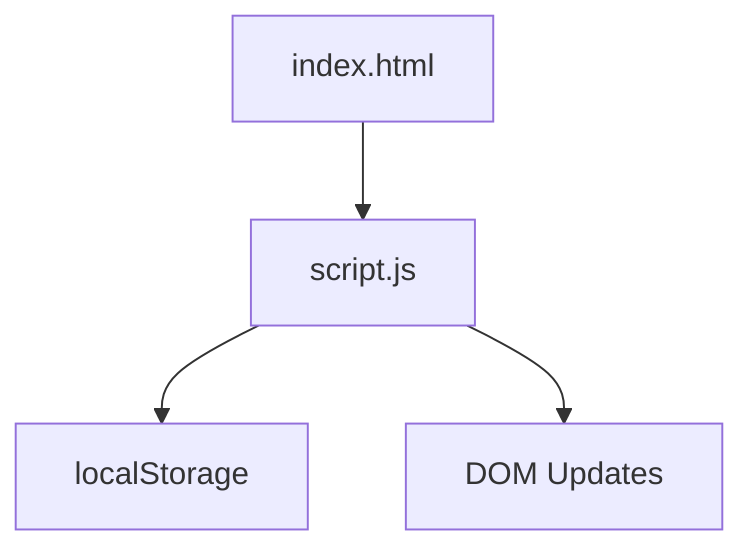

# Project Architecture

> **This is the standardized ARCHITECTURE.md template for the Cradle repository.**
> Copy this file into your project folder, rename it `ARCHITECTURE.md`, and replace every placeholder with details specific to your project. Delete any section that does not apply and remove this notice block before submitting.
>
> Template location: [`ARCHITECTURE_TEMPLATE.md`](../../ARCHITECTURE_TEMPLATE.md) at the repository root.

---

## Overview

<!--
Write 2–4 sentences describing what this project does and why it exists.
Keep it beginner-friendly — assume the reader has never seen this project before.

Example (game):
  Snake Game is a classic arcade game where the player controls a growing snake,
  eating food to score points while avoiding walls and its own tail.
  It runs entirely in the browser with no external dependencies.

Example (productivity tool):
  Attendance Tracker helps students monitor their class attendance across subjects.
  It stores data in localStorage so records persist between sessions without a backend.
-->

---

## Purpose & Goals

<!--
List the specific goals this project is trying to achieve.
Use short bullet points.

Example:
- Demonstrate how to manage game state without a framework
- Provide a reusable canvas rendering pattern for future projects
- Keep the codebase small enough for a first-time contributor to read in under 30 minutes
-->

- <!-- Goal 1 -->
- <!-- Goal 2 -->
- <!-- Goal 3 -->

---

## Folder Structure

<!--
Show the actual folder tree using a fenced code block.
Add a short inline comment after each important file.
Only include files that really exist — do not invent structure.

Example:
```
project-name/
├── index.html      # Entry point and UI shell
├── script.js       # Core logic and event handling
├── style.css       # All visual styling
└── assets/
    ├── images/     # Project images
    └── icons/      # Icon files
```
-->

```
project-name/
├── index.html      # <!-- describe purpose -->
├── script.js       # <!-- describe purpose -->
├── style.css       # <!-- describe purpose -->
└── <!-- add or remove files as needed -->
```

---

## System / Project Architecture Overview

<!--
Describe the high-level architecture in plain language.
Explain how the major parts fit together.
Use a diagram only if it genuinely helps — Mermaid is supported on GitHub.

Example (no diagram):
  The project follows a simple separation of concerns: index.html defines the
  structure, style.css handles all presentation, and script.js owns all behaviour.
  There is no build step — the browser loads files directly.

Example (with Mermaid):

-->

---

## Component Breakdown

<!--
Explain the role of each major file or module.
Use a table for quick scanning, then add detail below if needed.

Example table:
| File | Responsibility |
|---|---|
| `index.html` | Page shell, semantic structure, loads scripts |
| `script.js` | Game loop, state management, event handling |
| `style.css` | Layout, colours, animations, responsive design |
| `logic.js` | Pure game rules with no DOM dependency |
-->

| File | Responsibility |
|---|---|
| `index.html` | <!-- describe --> |
| `script.js` | <!-- describe --> |
| `style.css` | <!-- describe --> |

---

## Data Flow / Execution Flow

<!--
Walk through what happens from the moment the user opens the page to
the moment they interact with it. Use a simple arrow diagram.

Example:
```
User opens index.html
        ↓
Browser loads style.css → script.js
        ↓
Initialization runs — state is set up
        ↓
Event listeners are attached
        ↓
User interacts (click / keypress)
        ↓
Event handler fires
        ↓
State updates
        ↓
DOM re-renders
```
-->

```
User opens index.html
        ↓
<!-- describe next step -->
        ↓
<!-- describe next step -->
        ↓
<!-- describe next step -->
```

---

## Key Features

<!--
List the features a user or contributor would notice.
Be specific — avoid vague statements like "it works well".

Example:
- 4×4 sliding tile grid with merge-on-collision logic
- Score counter and persistent best score via localStorage
- Keyboard (arrow keys) and WASD controls
- Win detection at 2048 and loss detection when no moves remain
- Restart button resets state without a page reload
-->

- <!-- Feature 1 -->
- <!-- Feature 2 -->
- <!-- Feature 3 -->

---

## Technologies Used

<!--
List every language, library, API, or tool used.
Note the version if it matters.

Example:
| Technology | Purpose |
|---|---|
| HTML5 | Page structure and semantic markup |
| CSS3 (Grid, Flexbox, Custom Properties) | Layout and responsive design |
| Vanilla JavaScript (ES6+) | Game logic and DOM manipulation |
| localStorage API | Persisting best score across sessions |
| Chart.js 4.x (CDN) | Rendering the attendance pie chart |
-->

| Technology | Purpose |
|---|---|
| HTML5 | <!-- describe --> |
| CSS3 | <!-- describe --> |
| JavaScript | <!-- describe --> |

---

## File Responsibilities

<!--
Go deeper than the component breakdown table.
Describe specific functions, classes, or important variables in each file
so a new contributor knows where to look when they want to change something.

Example:
### script.js
- `render()` — clears and redraws the entire board from the current state object
- `handleKeydown(event)` — maps arrow and WASD keys to direction strings
- `handleMove(direction)` — calls logic, persists best score, triggers re-render
- `restartGame()` — creates a fresh state and re-renders

### logic.js
- `createInitialState()` — returns a fresh 4×4 board with two starting tiles
- `moveGameState(state, direction)` — returns a new immutable state after a move
- `collapseLine(line)` — merges a single row or column; returns merged line + score
- `hasWon(board)` — returns true if any tile value is ≥ 2048
- `canMove(board)` — returns true if at least one valid move exists
-->

### `index.html`

- <!-- key element or section 1 -->
- <!-- key element or section 2 -->

### `script.js`

- <!-- function/variable 1 -->
- <!-- function/variable 2 -->

### `style.css`

- <!-- key rule or pattern 1 -->
- <!-- key rule or pattern 2 -->

---

## Design Decisions

<!--
Explain non-obvious choices made during development.
This is especially useful for reviewers and future contributors.

Example:
- **Immutable state** — `moveGameState` always returns a new object rather than
  mutating state in place, making the logic easy to test and the history easy to track.
- **UMD wrapper in logic.js** — allows the same file to be loaded in a browser
  via a script tag and imported in Node.js for unit testing.
- **No framework** — kept vanilla to minimize the learning curve for contributors
  and avoid a build step.
-->

- <!-- Decision 1 and the reason for it -->
- <!-- Decision 2 and the reason for it -->

---

## Dependencies

<!--
List external dependencies. For projects with none, say so explicitly.

Example with dependencies:
| Dependency | Version | How loaded | Purpose |
|---|---|---|---|
| Chart.js | 4.x | CDN (`<script>` tag) | Pie chart rendering |
| jQuery | 3.4.1 | CDN (`<script>` tag) | DOM events and animation |
| Outfit (font) | — | Google Fonts CDN | UI typography |

Example with no dependencies:
None. This project uses only native browser APIs — no external libraries are required.
-->

| Dependency | Version | How loaded | Purpose |
|---|---|---|---|
| <!-- name --> | <!-- version --> | <!-- CDN / npm / local --> | <!-- purpose --> |

---

## Future Improvements

<!--
List ideas for improvement without committing to any of them.
Avoid touching the current implementation — this section is for inspiration only.

Example:
- Add touch/swipe support for mobile devices
- Persist the full board to localStorage so a game survives a page reload
- Add an undo stack — state is already immutable, so this would be straightforward
- Animate tiles sliding before they settle to improve game feel
-->

- <!-- Improvement 1 -->
- <!-- Improvement 2 -->
- <!-- Improvement 3 -->

---

## Known Limitations

<!--
Be honest about current shortcomings.
This helps contributors understand the scope of the project
and prevents duplicate bug reports.

Example:
- No mobile/touch support — keyboard only
- Pawn auto-promotes to queen only; no promotion choice dialog
- AI does not detect threefold repetition or the fifty-move rule
-->

- <!-- Limitation 1 -->
- <!-- Limitation 2 -->

---

## Development Notes

<!--
Practical notes for anyone who wants to run or modify this project locally.

Example:
- Open index.html through a local server (e.g. `python3 -m http.server 8000`),
  not by double-clicking the file. The file:// protocol blocks Web Workers
  and some fetch calls.
- logic.js uses a UMD wrapper so it can be tested with Node.js:
    node -e "const l = require('./logic.js'); console.log(l.createInitialState())"
- No build step is required. Edit the files and refresh the browser.
-->

- <!-- Note 1 -->
- <!-- Note 2 -->

---

## References

<!--
List any external resources that shaped the design or implementation.
Delete this section if there are no references.

Example:
- [2048 by Gabriele Cirulli](https://github.com/gabrielecirulli/2048) — original game
- [MDN Web Docs — Canvas API](https://developer.mozilla.org/en-US/docs/Web/API/Canvas_API)
- [Minimax algorithm — Wikipedia](https://en.wikipedia.org/wiki/Minimax)
-->

- <!-- Reference 1 -->
- <!-- Reference 2 -->
