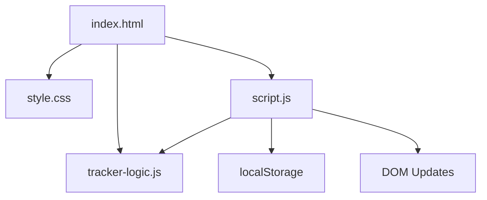

## Overview

Reading Progress Tracker is a browser-based tool for tracking books, reading sessions, and personal reading analytics. It stores all data in `localStorage` so records persist between sessions without a backend.

---

## Purpose & Goals

- Help readers monitor their progress across multiple books simultaneously
- Provide estimated completion dates based on measured reading velocity
- Visualize monthly reading output and genre diversity
- Track reading streaks to maintain reading habits

---

## Folder Structure

```
reading-progress-tracker/
├── index.html         # App shell, all sections and modals
├── style.css          # Full dark-theme styling and responsive layout
├── tracker-logic.js   # Pure business logic — UMD module testable in Node.js
├── script.js          # UI wiring, localStorage persistence, rendering
├── README.md          # User-facing documentation
└── ARCHITECTURE.md    # This file
```

---

## System / Project Architecture Overview

The project follows a clear separation of concerns across three layers:



- **tracker-logic.js** — Pure functions with no DOM dependency. Can be required in Node.js for unit testing.
- **script.js** — Owns all state management, renders the DOM, and delegates computations to `tracker-logic.js`.
- **index.html** — Defines the static skeleton: dashboard cards, tab panels, book grid, modals.
- **style.css** — Single stylesheet controlling all visual presentation and responsive layout.

---

## Component Breakdown

| File | Responsibility |
|---|---|
| `index.html` | App shell, stats dashboard, tab navigation, filter bar, book grid, session list, analytics section, three modals |
| `tracker-logic.js` | `calculateBookProgress`, `estimateCompletionDate`, `calculateReadingStreak`, `calculateReadingStats`, `exportTrackerData`, `importTrackerData` |
| `script.js` | State load/save, render functions, modal open/close, event wiring, export/import orchestration |
| `style.css` | CSS custom properties design system, book cards, progress bars, bar charts, genre bars, modal animations |

---

## Data Flow / Execution Flow

```
User opens index.html
        ↓
Browser loads style.css → tracker-logic.js → script.js
        ↓
init() runs — loadState() reads localStorage into `state`
        ↓
render() called — stats, library, sessions, analytics are drawn
        ↓
User adds / edits book or logs session
        ↓
Modal form submitted → state mutated → saveState() → render()
        ↓
DOM re-renders from state (no partial patching)
```

---

## Key Features

- Book library with per-book progress bars, status badges, and estimated finish dates
- Reading session log with automatic page advance on the parent book
- Statistics dashboard: total books, completed, currently reading, pages read, hours, streak
- Monthly pages-read bar chart built from session data
- Genre breakdown horizontal bar chart
- Average reading speed (pages/hour) and longest streak
- Export to JSON / Import from JSON for data portability
- Reading streak detection: current and longest consecutive-day streaks

---

## Technologies Used

| Technology | Purpose |
|---|---|
| HTML5 | Semantic page structure and modal dialogs |
| CSS3 (Custom Properties, Grid, Flexbox) | Dark-theme design system and responsive layout |
| Vanilla JavaScript (ES6+) | State management, DOM rendering, business logic |
| localStorage API | Persisting books and sessions across page reloads |
| Google Fonts (Outfit, JetBrains Mono) | Typography |

---

## File Responsibilities

### `tracker-logic.js`

- `calculateBookProgress(book)` — Returns percentage, remaining pages, completion flag
- `estimateCompletionDate(book, sessions, defaultVelocity)` — Calculates finish date from velocity
- `calculateReadingStreak(sessions)` — Returns current and longest consecutive-day streaks
- `calculateReadingStats(books, sessions)` — Aggregates all statistics for the dashboard
- `exportTrackerData(books, sessions)` — Serialises state to a JSON string
- `importTrackerData(jsonString)` — Parses and validates an export JSON string

### `script.js`

- `loadState()` / `saveState()` — Read / write state from localStorage
- `render()` — Orchestrates all four rendering passes
- `renderStats()` — Fills the six stat-card values
- `renderLibrary()` — Filters books and generates book card HTML
- `renderSessions()` — Generates session row HTML, sorted by date desc
- `renderAnalytics()` — Draws bar charts and genre breakdown
- `openBookModal(id?)` / `saveBook()` / `deleteBook()` — CRUD for books
- `openSessionModal(id?, preselectedBook?)` / `saveSession()` — CRUD for sessions
- `openDetailModal(bookId)` — Shows full progress and session history for one book

### `style.css`

- CSS custom properties on `:root` for the full colour system
- `.book-card` with hover lift and progress bar animation
- `.session-row` with grid layout for compact display
- `.bar-chart-container` and `.bar-column` for the monthly chart
- `@keyframes modalIn` for modal entrance animation

---

## Design Decisions

- **UMD wrapper in tracker-logic.js** — Allows the same module to run in a browser via `<script>` and be `require()`d in Node.js for unit tests, matching the project's testing pattern.
- **Full re-render on state change** — Keeps rendering logic simple and predictable; performance is acceptable at typical library sizes (< 500 books).
- **Velocity-based completion estimate** — Falls back from book-specific velocity → global velocity → a configurable default (25 pages/day) to always show a useful estimate.
- **No framework** — Stays consistent with the rest of the Cradle repository; minimises the learning curve for new contributors.

---

## Dependencies

None. This project uses only native browser APIs — no external libraries are required.

---

## Future Improvements

- Reading goals: weekly or monthly target pages with a progress indicator
- Book cover images via Open Library Covers API
- CSV export of session history
- Dark/light theme toggle
- Multiple reading lists / shelves (e.g. favourites, wishlist)

---

## Known Limitations

- All data is stored in browser localStorage — clearing browser data will erase the library
- No cloud sync or multi-device support
- Completion estimate assumes a constant reading velocity, which may not reflect irregular readers

---

## Development Notes

- Open `index.html` through a local server (e.g. `python3 -m http.server 8000`), not by double-clicking the file, to avoid `file://` restrictions on some browsers.
- Run unit tests with Node.js:
  ```bash
  node --test tests/reading-progress-tracker.test.js
  ```
- No build step required — edit and refresh the browser.

---

## References

- [MDN Web Docs — localStorage](https://developer.mozilla.org/en-US/docs/Web/API/Window/localStorage)
- [MDN Web Docs — FileReader API](https://developer.mozilla.org/en-US/docs/Web/API/FileReader)
